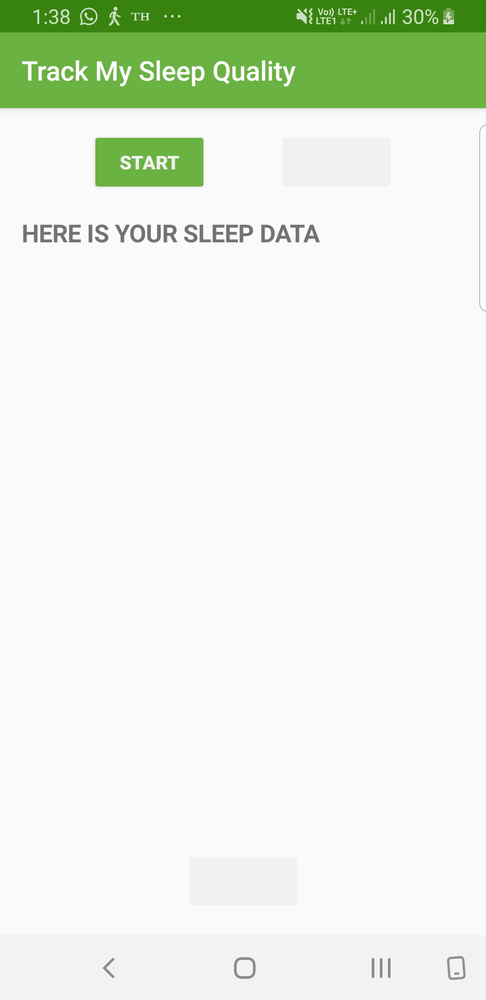
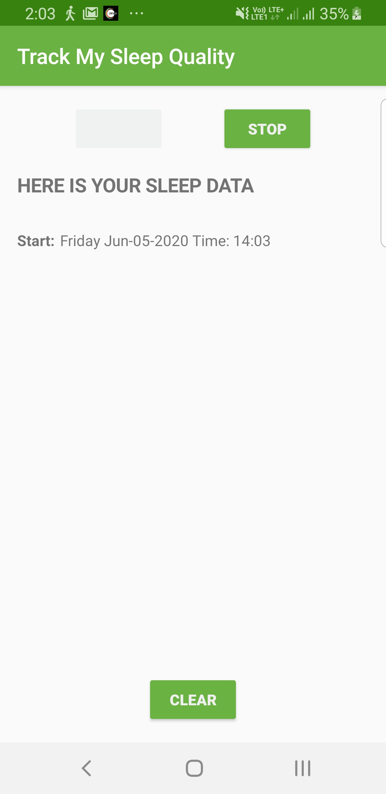
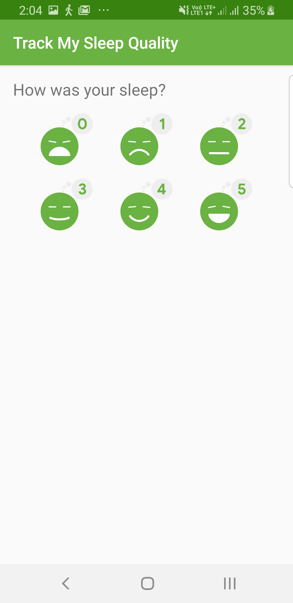
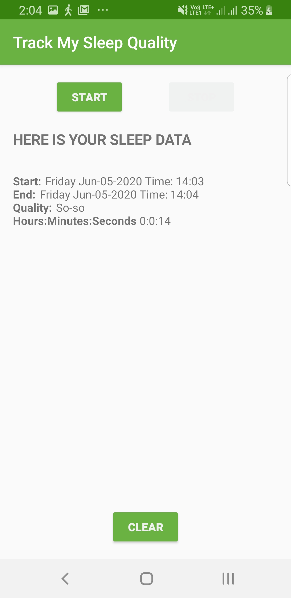
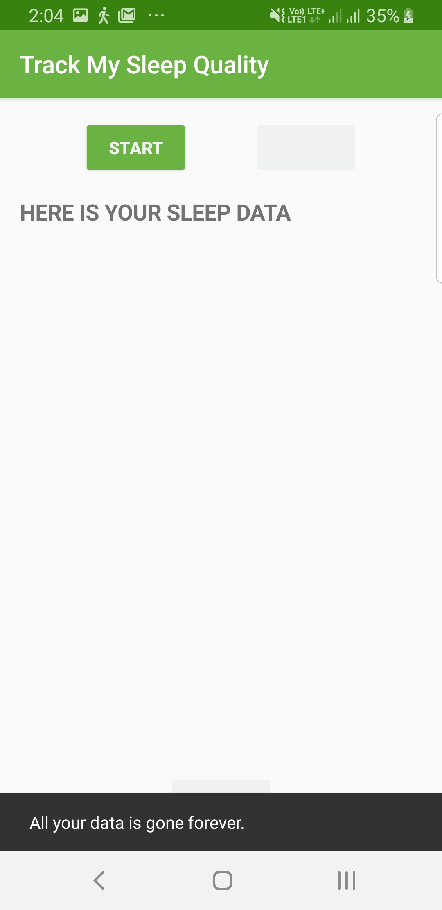

=======
# 30-Days-Of-Kotlin-Track-My-Sleep-Quality

## SleepQualityTracker

The SleepQualityTracker app is a demo app that helps you collect information about your sleep. 
* Start time
* End time
* Quality
* Time slept

This app demonstrates the following views and techniques:
* Room database
* DAO
* Coroutines

It also uses and builds on the following techniques from previous lessons:
* ViewModel Factory
* Using Backing Properties to protect MutableLiveData
* Observable state LiveData variables to trigger navigation

## Screenshots

